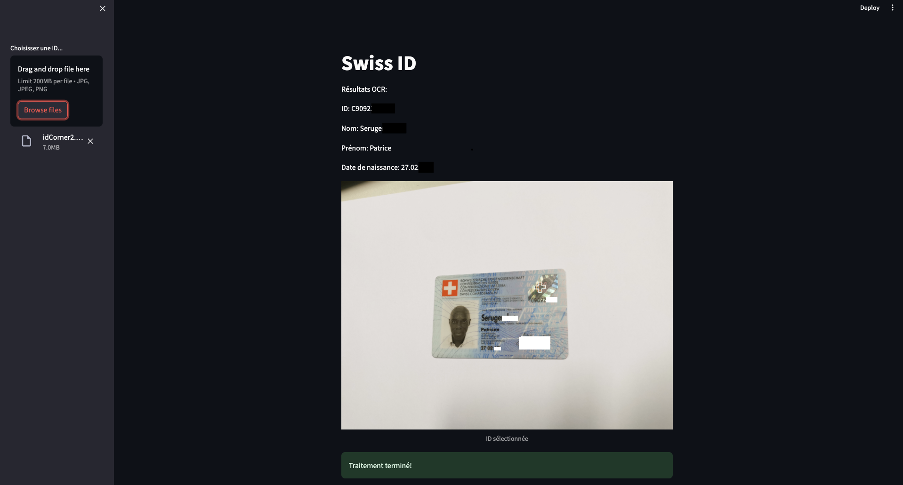
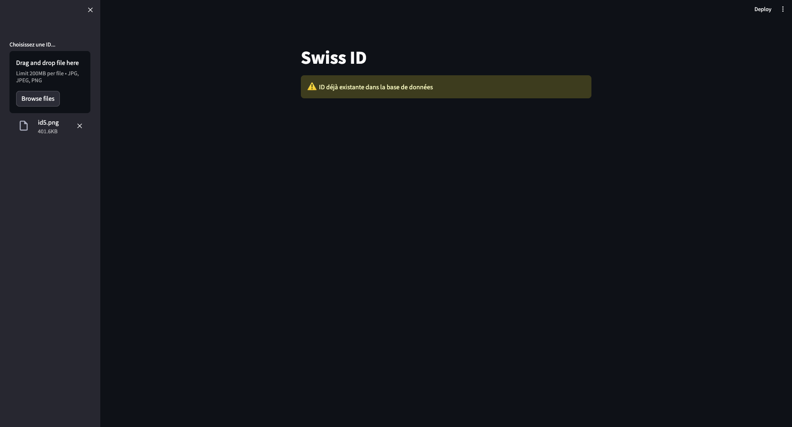

# OCR POUR EXTRACTION DE DONNÉES DES ID SUISSES

Spécialement conçu pour extraire des données à partir de cartes d'identité suisses. Optimisé pour gérer diverses qualités de photos et conditions d'éclairage, en se concentrant sur l'extraction précise des informations telles que :

- Nom
- Prénom
- Date de naissance
- Numéro d'identification de la carte

Les données extraites sont automatiquement stockées dans une base de données MySQL pour faciliter leur gestion et leur accès.

---
---

## 🖼️ Aperçu Visuel

Voici un aperçu des résultats obtenus avec le projet :

### 📋 Image avec Extraction Réussie


---

### ⚠️ Image avec doublons


---


## 🛠️ Fonctionnalités Principales

- **Gestion des Qualités de Photo** : Traitement des images de qualité variable pour améliorer la reconnaissance sous différents éclairages.
- **Extraction de Données Personnelles** : Identification précise et fiable des informations critiques.
- **Précision Optimisée** : Entraînement sur un ensemble de données étendu pour des résultats plus précis.
- **Stockage Structuré** : Sauvegarde des données extraites dans une base MySQL pour un accès et une gestion simplifiés.
- **Adaptabilité** : Compatible avec les cartes d'identité suisses.

---


## 🚀 Comment Utiliser ce Projet

1. **Cloner le Dépôt**  
   ```bash
   git clone https://github.com/votre-nom-utilisateur/ocr-id-suisse.git
   cd ocr-id-suisse
